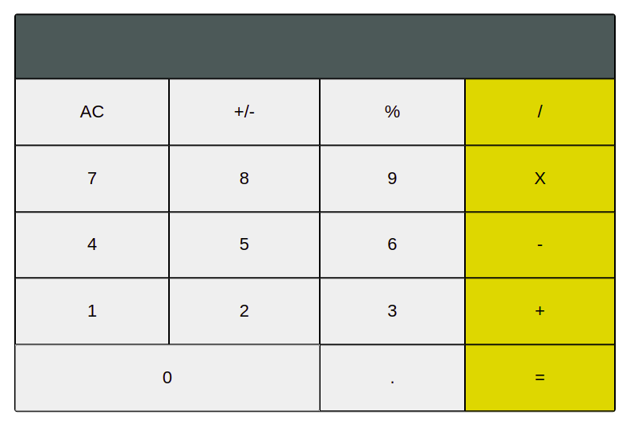

# math-magicians
My first react app


# math-magicians
On this step of my project, I add componets, props and state for my app

> Open with with the server

.

## Built With

- React
- Visual Studio Code.
- Linters
- Gitflow

## Live Demo

[github page](https://github.com/moise-mulungu/math-magicians)

[live demo](https://moise-mulungu.github.io/math-magicians/dist/)

## Getting Started

To get a local copy of this app you can use :
```
git clone  https://github.com/moise-mulungu/math-magicians
```
# Install

- Run :
1. `npm create-<app's name> .`
2. `cd <app's name>`,
3. `npm start`

# Usage

Run `npm start` to open the live server

## Author

👤 **Moise Mulungu**

- GitHub: [Moise Mulungu](https://github.com/moise-mulungu)
- Twitter: [Moise Mulungu](https://twitter.com/moise_mulungu)
- LinkedIn: [Moise Mulungu](https://www.linkedin.com/in/mo%C3%AFse-mulungu-a939831b2/)

## 🤝 Contributing

Contributions, issues, and feature requests are welcome!

Feel free to check the [issues page](https://github.com/moise-mulungu/math-magicians/issues).


## Show your support

Give a ⭐️ if you like this project!

## 📝 License

This project is [MIT](./MIT.md) licensed.
 

